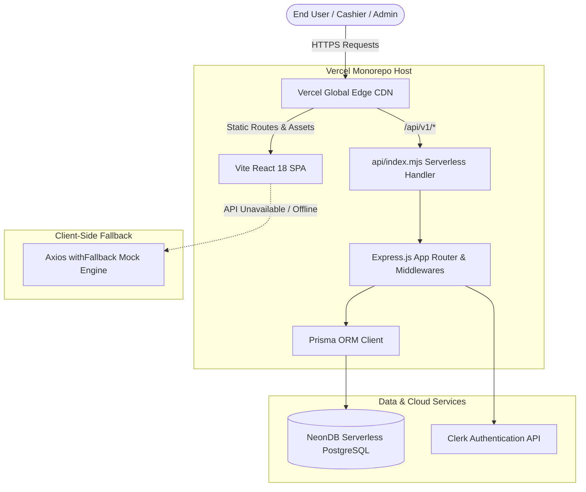
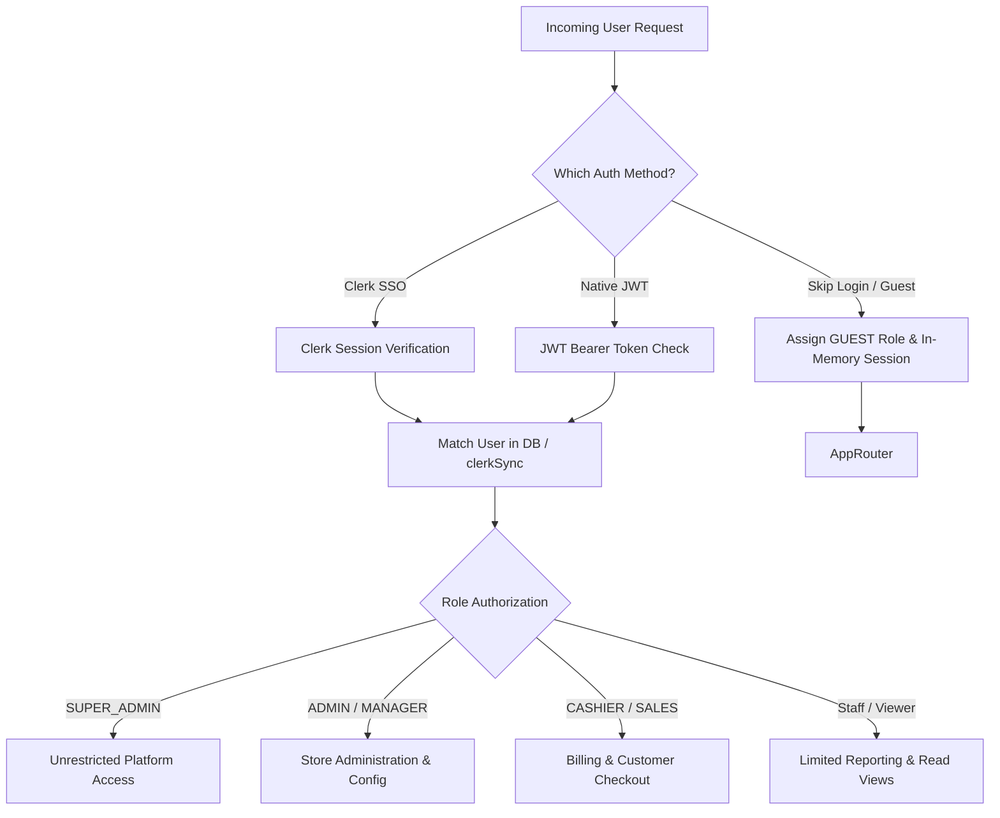
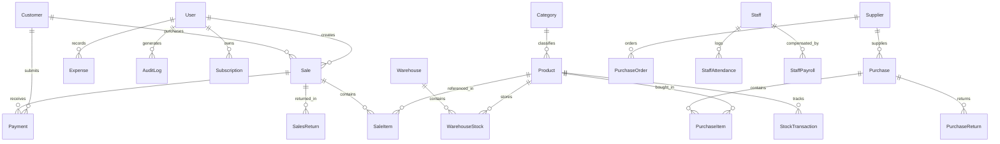
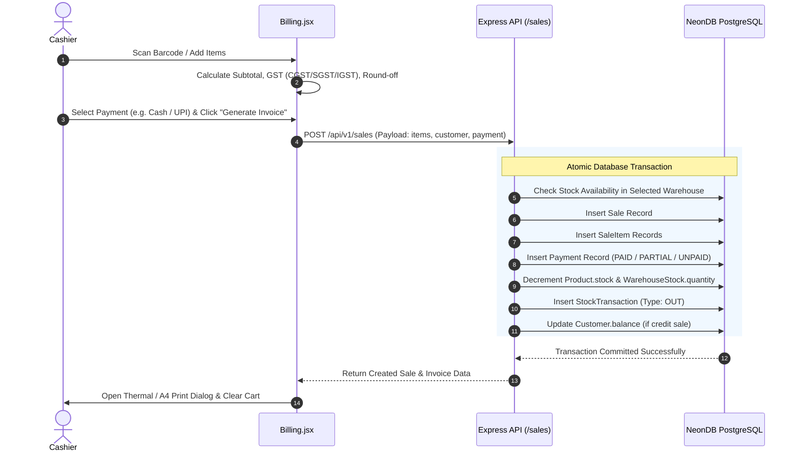

# 📖 BILZET — Complete End-to-End System Documentation & Architectural Guide

> **Next-Generation Cloud POS, Multi-Warehouse ERP, GST Compliance & Billing Platform**  
> *Version:* `1.0.0` | *Target Engine:* Node.js 18+ / React 18 / PostgreSQL (NeonDB) / Prisma ORM / Vercel Serverless

---

## 📑 Table of Contents

1. [Executive Summary](#1-executive-summary)
2. [High-Level Architecture & Deployment Topology](#2-high-level-architecture--deployment-topology)
3. [Technology Stack](#3-technology-stack)
4. [Directory & Project Layout](#4-directory--project-layout)
5. [Authentication, Security & Access Control](#5-authentication-security--access-control)
6. [Data Schema & Entity Models (Prisma & PostgreSQL)](#6-data-schema--entity-models-prisma--postgresql)
7. [Comprehensive Module Breakdown](#7-comprehensive-module-breakdown)
   - [7.1. Executive Dashboard](#71-executive-dashboard)
   - [7.2. High-Speed 3-Step Billing & POS Studio](#72-high-speed-3-step-billing--pos-studio)
   - [7.3. Inventory & Multi-Warehouse Godown Operations](#73-inventory--multi-warehouse-godown-operations)
   - [7.4. Sales Operations (Challans, Returns, Payments)](#74-sales-operations-challans-returns-payments)
   - [7.5. Purchases, Suppliers & Debit Notes](#75-purchases-suppliers--debit-notes)
   - [7.6. Customer Ledger & Credit Directory](#76-customer-ledger--credit-directory)
   - [7.7. Staff Attendance & Payroll Suite](#77-staff-attendance--payroll-suite)
   - [7.8. Omnichannel Online Orders](#78-omnichannel-online-orders)
   - [7.9. SMS Marketing Campaigns](#79-sms-marketing-campaigns)
   - [7.10. GST Compliance & CA Connect](#710-gst-compliance--ca-connect)
   - [7.11. Financial Reports & Profit/Loss Analytics](#711-financial-reports--profitloss-analytics)
   - [7.12. Store Settings & Invoice Customization](#712-store-settings--invoice-customization)
   - [7.13. Super Admin & Platform Command Center](#713-super-admin--platform-command-center)
   - [7.14. Subscription Plans & Feature Gates](#714-subscription-plans--feature-gates)
   - [7.15. Tamper-Evident Audit Logs](#715-tamper-evident-audit-logs)
8. [Data Flow & Business Logic Pipelines](#8-data-flow--business-logic-pipelines)
9. [Zero-Downtime Resilience & Offline Mock Fallback](#9-zero-downtime-resilience--offline-mock-fallback)
10. [REST API Directory](#10-rest-api-directory)
11. [Local Development & Setup Guide](#11-local-development--setup-guide)
12. [Production Deployment (Single Vercel Project)](#12-production-deployment-single-vercel-project)
13. [Troubleshooting, Performance & FAQs](#13-troubleshooting-performance--faqs)

---

## 1. Executive Summary

**BILZET** is an all-in-one, modern enterprise retail billing, Point of Sale (POS), warehouse inventory management, and Indian GST compliance suite. Designed to support modern retail counters, supermarkets, wholesale dealers, and multi-godown distribution networks, BILZET bridges the gap between fast front-desk checkout speed and back-office ERP accounting depth.

### Core Value Propositions
- **Sub-Second Checkout**: 3-step billing optimized for barcode scanning, thermal printers (58mm/80mm), A4/A5 invoices, and instant UPI QR generation.
- **GST-Ready Out of the Box**: Automated HSN/SAC tax breakdown, CGST/SGST/IGST calculation, GSTR-1 draft export, GSTR-3B computation, and Chartered Accountant read-only invitation portals.
- **Multi-Warehouse & Godowns**: Real-time multi-location inventory tracking, inter-warehouse transfers with approval states, and delivery challans.
- **Integrated Workforce & Omnichannel**: Built-in staff attendance, payroll generation, SMS bulk marketing, and omnichannel online order tracking.
- **Zero-Failure Architecture**: Built-in client-side mock-data fallback ensures the frontend operates seamlessly for demonstrations or during temporary backend cold-starts.

---

## 2. High-Level Architecture & Deployment Topology

BILZET is architected as a **Full-Stack Monorepo** that can run either in traditional container/VM configurations or as a **Single Serverless Deployment on Vercel**.



### Architectural Benefits:
1. **Unified Origin**: When hosted on Vercel, both frontend assets and `/api/*` endpoints share the identical domain, eliminating CORS preflight latency.
2. **Cold-Start Resilience**: Prisma Client is instantiated with `globalThis` caching to prevent PostgreSQL serverless connection exhaustion across serverless lambdas.
3. **Decoupled Fallback**: Even if the database connection warms up or fails, the frontend catches the network exception and serves structured demo mock data, ensuring uninterrupted demonstrations.

---

## 3. Technology Stack

### Frontend Ecosystem
- **Framework & Runtime**: React 18.3, Vite 4+
- **Styling & Design System**: Tailwind CSS v4, Glassmorphic CSS Design Tokens, Lucide React Icons
- **Animation Engine**: Framer Motion 12+ (smooth view transitions, modal overlays, spring physics)
- **State Management**: Zustand (Auth store, security store, session management)
- **Forms & Validation**: React Hook Form, Zod schema validation
- **Data Visualization**: Recharts (Monthly sales curves, category distributions, profit metrics)
- **Barcodes & QRs**: `qrcode` (instant UPI payments), `bwip-js` (Code128 barcode generation)
- **Authentication Client**: `@clerk/clerk-react` + native JWT token storage

### Backend Ecosystem
- **Runtime & Server**: Node.js (ES Modules), Express.js 4.21
- **Database & ORM**: PostgreSQL (Hosted on NeonDB Serverless), Prisma ORM 6.4
- **Security Middlewares**: Helmet (HTTP security headers), CORS, Express Rate Limit (strict brute-force limiter on auth, global limiter on general endpoints)
- **Document & Export Generators**: `pdfkit` (Dynamic server-rendered invoice generation), `exceljs` (GST spreadsheets & financial ledger exports)
- **Authentication Engine**: `@clerk/express` SDK alongside custom `jsonwebtoken` (JWT) and `bcryptjs`

---

## 4. Directory & Project Layout

```
BILZET/
├── api/
│   └── index.mjs               # Serverless entry point for Vercel deployment
├── vercel.json                 # Vercel serverless routing and rewrite rules
├── package.json                # Monorepo build orchestrator
├── DEPLOYMENT_GUIDE.md         # Step-by-step production deployment manual
├── README.md                   # Repository overview
│
├── BILZET_frontend/            # Client Application (React 18 + Vite + Tailwind v4)
│   ├── index.html              # Single page entry point
│   ├── package.json            # Frontend dependencies
│   ├── vite.config.js          # Vite build configuration
│   └── src/
│       ├── api/                # API client (Axios), endpoints & mockData fallback
│       │   ├── http.js         # Base axios instance with dynamic base URL
│       │   ├── index.js        # Structured service API modules
│       │   └── mockData.js     # Fallback datasets for zero-downtime offline mode
│       ├── components/         # Reusable design atoms & composite views
│       │   ├── auth/           # Clerk authentication widgets
│       │   ├── layout/         # App Header, Sidebar navigation, and Footers
│       │   └── ui/             # Reusable UI primitives (Buttons, Badges, Modals)
│       ├── pages/              # Primary view pages (Dashboard, Billing, Inventory, etc.)
│       │   ├── superAdmin/     # Platform Super Admin command center pages
│       │   ├── Admin.jsx       # Consolidated administrative portal
│       │   ├── Billing.jsx     # Live POS terminal and invoice preview
│       │   ├── Dashboard.jsx   # Business KPIs and analytics
│       │   ├── Inventory.jsx   # Stock tracking and stock adjustment dialogs
│       │   ├── Warehouses.jsx  # Multi-godown management
│       │   ├── StockTransfers.jsx # Inter-warehouse stock shift ledger
│       │   ├── StaffManagement.jsx# Staff roster, attendance, and payroll
│       │   ├── SalesOperations.jsx# Delivery challans and customer returns
│       │   ├── Purchases.jsx   # Purchase orders and bills
│       │   ├── SmsMarketing.jsx# Bulk SMS campaign manager
│       │   ├── OnlineOrders.jsx# E-commerce fulfillment pipeline
│       │   ├── Gst.jsx         # Tax calculations, GSTR-1, GSTR-3B
│       │   ├── CaConnect.jsx   # Chartered Accountant portal
│       │   ├── Reports.jsx     # Financial statements and analytics
│       │   ├── Settings.jsx    # Store identity and printer preferences
│       │   └── Support.jsx     # Help center and ticket submission
│       ├── routes/             # AppRoutes.jsx routing definitions & route guards
│       ├── store/              # Zustand auth & permissions store
│       └── utils/              # Calculation helpers, currency formatting, security
│
└── BILZET_backend/             # Server Application (Node.js + Express + Prisma)
    ├── package.json            # Backend dependencies & build scripts
    ├── prisma/
    │   ├── schema.prisma       # Full PostgreSQL database schema definition
    │   ├── seed.mjs            # Initial demo seed data generator
    │   └── seedSuperAdmin.mjs  # Root super admin user seeder
    └── src/
        ├── app.mjs             # Express application configuration & routing setup
        ├── server.mjs          # Standalone HTTP server listener for local execution
        ├── config/             # Environment, Prisma singleton, and constants
        ├── controllers/        # Route logic and database mutation handlers
        ├── middleware/         # Auth verification, rate limiting, error handling
        ├── routes/             # Express API v1 route blueprints
        ├── services/           # PDF printing, Excel export, and calculation services
        └── utils/              # Standardized API response wrappers
```

---

## 5. Authentication, Security & Access Control

BILZET provides a hybrid security architecture that supports enterprise enterprise social logins, traditional email/password credentials, and instant Guest exploration.



### 1. Clerk Social Authentication
- Enabled automatically when `CLERK_PUBLISHABLE_KEY` and `CLERK_SECRET_KEY` are present.
- Supports Google, Apple, and Email magic link sign-ins.
- Backend synchronizes Clerk identities to PostgreSQL via the `/api/v1/auth/clerk-sync` endpoint.

### 2. Native JWT Authentication
- Passwords are encrypted using `bcryptjs` (salt rounds: 10).
- Emits short-lived access tokens and refresh tokens.
- Strict brute-force rate limiter protects `/auth/login` (max 10 failed requests per 15-minute window).

### 3. Role-Based Access Control (RBAC) Matrix
The system enforces strict RBAC across both frontend navigation guards (`Protected`, `AdminEmailGuard`) and backend route middlewares:

| Role | Billing & POS | Stock & Warehouses | Purchases | Payroll & Staff | Reports & GST | Super Admin Portal |
|---|:---:|:---:|:---:|:---:|:---:|:---:|
| `SUPER_ADMIN` | ✅ | ✅ | ✅ | ✅ | ✅ | ✅ |
| `ADMIN` | ✅ | ✅ | ✅ | ✅ | ✅ | ❌ |
| `MANAGER` | ✅ | ✅ | ✅ | ✅ | ✅ | ❌ |
| `CASHIER` | ✅ | Read Only | ❌ | ❌ | ❌ | ❌ |
| `SALES_STAFF` | ✅ | Read Only | ❌ | ❌ | ❌ | ❌ |
| `PURCHASE_STAFF`| ❌ | Read Only | ✅ | ❌ | ❌ | ❌ |
| `INVENTORY_STAFF`| ❌ | ✅ | Read Only | ❌ | ❌ | ❌ |
| `HR_MANAGER` | ❌ | ❌ | ❌ | ✅ | ❌ | ❌ |
| `VIEWER` / `GUEST`| Read Only | Read Only | Read Only | Read Only | Read Only | ❌ |

---

## 6. Data Schema & Entity Models (Prisma & PostgreSQL)

The database schema is defined in [schema.prisma](file:///c:/Users/KARTHIK/Downloads/BILZET-main%20%284%29/BILZET-main/BILZET_backend/prisma/schema.prisma) with full relational integrity and cascade policies.



### Key Models Reference:
- **`User`**: Account identity, hashed passwords, role assignments, avatar, and active status.
- **`Product` & `Category`**: Inventory master, barcode, SKU, brand, unit, purchase price, selling price, GST rate, and reorder threshold (`minimumStock`).
- **`Warehouse` & `WarehouseStock`**: Godown definitions and per-warehouse inventory counts.
- **`StockTransfer`**: Logs inter-warehouse shifts from source godown to target godown with approval states.
- **`Customer`**: Contact directory, GSTIN, credit limits, and outstanding ledger balance.
- **`Sale` & `SaleItem`**: Invoices with full financial decomposition (subtotal, discounts, CGST, SGST, IGST, round-off, amount received, balance due, payment status).
- **`SalesReturn` & `DeliveryChallan`**: Post-sale operational workflows for customer credit adjustments and goods dispatch.
- **`Supplier`, `PurchaseOrder`, `Purchase` & `DebitNote`**: Complete inbound supply-chain purchasing cycle.
- **`Staff`, `StaffAttendance` & `StaffPayroll`**: Employee directory, daily punch logs (Present, Absent, Half Day, Leave), and monthly salary computation.
- **`OnlineOrder`**: E-commerce fulfillment records with delivery tracking.
- **`SmsCampaign`**: Marketing outreach targeting customer groups (ALL, REGULAR, NEW, INACTIVE).
- **`AuditLog`**: Security compliance records capturing actor, action, timestamp, altered JSON payloads, and IP addresses.
- **`ShopSettings`**: Business profile, logo, GSTIN, invoice prefix, paper format (A4/A5/Thermal), and legal disclaimers.

---

## 7. Comprehensive Module Breakdown

### 7.1. Executive Dashboard
- **Route:** `/dashboard`
- **Purpose:** Central operational nerve center displaying real-time financial health and quick-action triggers.
- **Key Features:**
  - **4 Top KPI Metric Cards**: Net Revenue, Cash & UPI Collections, Total Customer Dues, and Total GST Liability.
  - **Live GST Readiness Score**: Evaluates sales data against compliance checks (100/100 score meter).
  - **Visual Trend Analytics**: Recharts Area charts rendering daily sales curves and gross profit trajectories.
  - **Document Activity Stream**: Displays latest invoices, returns, and payments with 1-click view and reprint triggers.
  - **Fast Action Bar**: Direct access to Create Bill, Stock Intake, Settings, and CA Connect.

### 7.2. High-Speed 3-Step Billing & POS Studio
- **Route:** `/billing`
- **Purpose:** Counter checkout interface engineered to minimize transaction friction.
- **Workflow:**
  1. **Customer Step**: Auto-suggests existing customers via phone number or name; one-click creation of new customers; sale type selection (B2C Retail, B2B Registered, SEZ Zero Rated); automatic Place of Supply detection (defaults to store's state).
  2. **Product Step**: Barcode scanner listener; instant SKU/name search; line item additions; dynamic quantity, discount %, and tax rate calculation.
  3. **Payment Step**: Express settlement buttons (`Cash Paid`, `UPI Paid`, `Generate UPI QR`, `Pay Later / Credit`).
- **Live Invoice Preview Studio**:
  - Live side-by-side tax invoice view updating synchronously as items or discounts change.
  - Supports switching print formats on the fly: **A4 Standard**, **A5 Compact**, and **80mm Thermal Slip**.
  - Dynamic UPI QR Code rendered in real-time using merchant VPA for customer mobile scanning.

### 7.3. Inventory & Multi-Warehouse Godown Operations
- **Routes:** `/inventory`, `/warehouses`, `/warehouses/transfer`
- **Purpose:** Complete control over stock counts, godowns, and warehouse movements.
- **Key Features:**
  - **Warehouse Management (`/warehouses`)**: Create physical godowns (e.g., Central Warehouse, Retail Front Shelf, Basement Store), assign contact persons, and view location-specific stock.
  - **Inter-Warehouse Transfers (`/warehouses/transfer`)**: Move stock between godowns with transfer tracking numbers, timestamps, and validation to prevent negative warehouse quantities.
  - **Stock Adjustment Modal**: Quick increment for supplier deliveries or decrement for damaged/expired items with transaction logging.
  - **Low-Stock Alerting**: Visual progress bars turning amber/red when stock falls below `minimumStock`.

### 7.4. Sales Operations (Challans, Returns, Payments)
- **Route:** `/sales/challans`, `/sales/returns`, `/sales/payments-in`
- **Purpose:** Managing non-billing post-sales transactions.
- **Key Features:**
  - **Delivery Challans**: Issue official transit delivery notes without generating immediate tax liabilities (useful for goods sent on approval or staged deliveries).
  - **Sales Returns**: Accept returned products, reverse inventory automatically into stock, and issue customer credit refunds.
  - **Payments-In Ledger**: Collect outstanding customer credit balances against historical unpaid or partial invoices.

### 7.5. Purchases, Suppliers & Debit Notes
- **Routes:** `/purchases`, `/purchases/orders`, `/purchases/debit-notes`, `/suppliers`
- **Purpose:** Complete vendor management and inbound procurement.
- **Key Features:**
  - **Purchase Orders (PO)**: Draft and send formal procurement orders to suppliers with expected delivery dates.
  - **Purchase Invoices**: Log vendor tax invoices, auto-increment central inventory counts, and calculate Input Tax Credit (ITC).
  - **Purchase Returns & Debit Notes**: Return defective supplier stock, issue formal debit notes, and debit the vendor's ledger balance.

### 7.6. Customer Ledger & Credit Directory
- **Route:** `/customers`
- **Purpose:** Customer relationship management, credit risk management, and purchase history.
- **Key Features:**
  - Searchable phonebook with customer GSTIN, address, and credit limits.
  - Real-time customer balance badge indicating if customer has outstanding dues or zero balance.
  - Drill-down customer drawer showing all lifetime invoices and payments.

### 7.7. Staff Attendance & Payroll Suite
- **Routes:** `/staff`, `/staff/attendance`, `/staff/payroll`
- **Purpose:** Internal HR and payroll automation for retail and warehouse staff.
- **Key Features:**
  - **Staff Roster**: Maintain employee profiles, roles, departments (Sales, Inventory, Admin), and base monthly salaries.
  - **Daily Attendance Tracker**: Mark status (`PRESENT`, `ABSENT`, `HALF_DAY`, `LEAVE`, `OVERTIME`) with working hours.
  - **Payroll Generator**: Calculates net pay factoring in base salary, overtime pay, bonuses, and deductions; generates monthly salary disbursement slips.

### 7.8. Omnichannel Online Orders
- **Route:** `/online-orders`
- **Purpose:** Centralized hub for processing incoming web or WhatsApp e-commerce orders.
- **Key Features:**
  - Kanban/Table pipeline: `PENDING` ➔ `CONFIRMED` ➔ `PROCESSING` ➔ `PACKED` ➔ `SHIPPED` ➔ `DELIVERED`.
  - Customer contact details, delivery address, and payment status indicators.
  - 1-click conversion from online order to finalized tax invoice.

### 7.9. SMS Marketing Campaigns
- **Route:** `/sms-marketing`
- **Purpose:** Direct customer re-engagement and promotional messaging.
- **Key Features:**
  - Audience Segmentation: Filter recipients by `ALL`, `REGULAR` (repeat buyers), `NEW` (first-time shoppers), or `INACTIVE` (no visits in 30+ days).
  - Campaign creation with dynamic tags (`{name}`, `{shop_name}`).
  - Delivery analytics tracking sent, delivered, and failed message counts.

### 7.10. GST Compliance & CA Connect
- **Routes:** `/gst`, `/ca-connect`
- **Purpose:** Automating Indian Goods and Services Tax filing preparation.
- **Key Features:**
  - **GSTR-1 Summary**: Segregated tables for B2B registered supplies, B2C large & small invoices, and credit/debit notes.
  - **GSTR-3B Computation**: Net outward tax payable minus Input Tax Credit (ITC) calculated from purchase bills.
  - **HSN/SAC Code Summary**: Aggregated quantity, total taxable value, and tax brackets (0%, 5%, 12%, 18%, 28%).
  - **CA Connect**: Send a secure email invitation to your Chartered Accountant to grant read-only access to GST reports and financial registers.

### 7.11. Financial Reports & Profit/Loss Analytics
- **Route:** `/reports`
- **Purpose:** Comprehensive financial auditing and business intelligence.
- **Key Features:**
  - **Sales Reports**: Daily, monthly, and annual sales trends.
  - **Profit & Loss**: Revenue minus Cost of Goods Sold (COGS) and operational expenses.
  - **Inventory Valuation**: Current asset value of warehouse stock calculated at purchase price vs. expected retail realization.
  - **1-Click Export**: Export reports directly to Microsoft Excel (`.xlsx`) or PDF.

### 7.12. Store Settings & Invoice Customization
- **Route:** `/settings`
- **Purpose:** Business profile configuration and document styling.
- **Key Features:**
  - Store identity (Shop name, owner name, address, phone, GSTIN, state code).
  - Invoice styling (Prefix configuration e.g. `BILZET/26-27/`, default paper format A4, A5, or 80mm).
  - Custom terms & conditions, bank account details for UPI/NEFT, and footer signatures.

### 7.13. Super Admin & Platform Command Center
- **Route:** `/admin`
- **Purpose:** Multi-tenant platform management and system governance.
- **Key Features:**
  - **Tenant User Management**: View all registered shop owners, inspect activity, toggle active status, or trigger credential resets.
  - **System Maintenance Mode**: Toggle global maintenance banner with custom messaging across the platform.
  - **Platform Announcements**: Broadcast real-time notifications to all logged-in store merchants.
  - **Global Configuration Vault**: Manage system configurations without modifying database code.

### 7.14. Subscription Plans & Feature Gates
- **Route:** `/plans`
- **Purpose:** SaaS tier management and monetization.
- **Tiers:**
  - **Free Starter (`₹0/yr`)**: Up to 100 bills/month, standard A4 invoices, single warehouse.
  - **Pro Tier (`₹1,499/yr`)**: Unlimited bills, thermal printing, GSTR-1 export, WhatsApp PDF share, CA Connect.
  - **Enterprise / Premium Tier (`₹2,999/yr`)**: Multi-warehouse godowns, staff payroll, SMS marketing, advanced GST automation, and dedicated support.

### 7.15. Tamper-Evident Audit Logs
- **Route:** `/audit-logs`
- **Purpose:** Security traceability and internal control.
- **Key Features:**
  - Records all critical state alterations (Invoice cancellations, inventory adjustments, user role modifications).
  - Captures initiating user ID, target entity, timestamp, client IP, and before/after JSON diffs.

---

## 8. Data Flow & Business Logic Pipelines

### The Checkout & Inventory Depletion Lifecycle



---

## 9. Zero-Downtime Resilience & Offline Mock Fallback

BILZET includes an enterprise-grade client resilience pattern in [BILZET_frontend/src/api/index.js](file:///c:/Users/KARTHIK/Downloads/BILZET-main%20%284%29/BILZET-main/BILZET_frontend/src/api/index.js):

```javascript
const withFallback = (promise, fallbackValue) =>
  promise.catch((err) => {
    console.warn("Backend API offline — serving demo data fallback:", err?.message || err);
    return fallbackValue;
  });
```

### Why this is critical:
1. **Serverless Cold Starts**: When deployed on NeonDB serverless PostgreSQL, the database may experience a 1–2 second wake-up latency on initial connection. The application intercepts connection failures smoothly rather than breaking the UI.
2. **Offline & Demo Readiness**: Evaluators, salespeople, or prospective clients can click **"Skip Login"** on `/sign-in` and immediately test every screen, chart, inventory view, and invoice preview without needing local database configurations.

---

## 10. REST API Directory

All backend endpoints are prefixed with `/api/v1`.

### Authentication & Users (`/auth`, `/users`)
| Method | Endpoint | Description | Auth Required |
|---|---|---|:---:|
| `POST` | `/auth/register` | Register new store merchant | No |
| `POST` | `/auth/login` | Authenticate with email and password | No |
| `POST` | `/auth/google` | Google OAuth identity verification | No |
| `POST` | `/auth/clerk-sync` | Synchronize Clerk user identity to PostgreSQL | Yes (Clerk) |
| `GET` | `/auth/me` | Fetch active session user profile | Yes |
| `POST` | `/auth/logout` | Invalidate active session tokens | Yes |
| `GET` | `/users` | List tenant team members | Yes (Admin) |
| `PATCH`| `/users/:id` | Update team member role/status | Yes (Admin) |

### Products & Categories (`/products`, `/categories`)
| Method | Endpoint | Description | Auth Required |
|---|---|---|:---:|
| `GET` | `/products` | List products with pagination and filters | Yes |
| `POST` | `/products` | Create a new product with SKU & GST rate | Yes |
| `GET` | `/products/:id` | Fetch specific product details | Yes |
| `PATCH`| `/products/:id` | Update product pricing or details | Yes |
| `DELETE`| `/products/:id`| Soft delete or remove product | Yes |
| `GET` | `/products/barcode/:code` | Fast barcode scan lookup | Yes |
| `GET` | `/categories` | List product categories | Yes |
| `POST` | `/categories` | Create product category | Yes |

### Sales & Invoicing (`/sales`, `/invoices`)
| Method | Endpoint | Description | Auth Required |
|---|---|---|:---:|
| `POST` | `/sales` | Process new checkout bill and deduct stock | Yes |
| `GET` | `/sales` | Retrieve historical sales invoices | Yes |
| `GET` | `/sales/:id` | Get full invoice breakdown | Yes |
| `POST` | `/sales/:id/return` | Process return and issue credit note | Yes |
| `GET` | `/sales/returns` | List sales return records | Yes |
| `GET` | `/sales/challans` | List delivery challans | Yes |
| `POST` | `/sales/challans` | Issue new delivery transit challan | Yes |
| `POST` | `/sales/payments-in`| Log customer credit dues settlement | Yes |

### Warehouses & Multi-Godown Transfers (`/warehouses`)
| Method | Endpoint | Description | Auth Required |
|---|---|---|:---:|
| `GET` | `/warehouses` | List all godown locations & stock levels | Yes |
| `POST` | `/warehouses` | Register new warehouse location | Yes |
| `POST` | `/warehouses/transfer` | Execute stock transfer between godowns | Yes |
| `GET` | `/warehouses/transfers`| Retrieve transfer audit history | Yes |

### Purchases & Suppliers (`/purchases`, `/suppliers`)
| Method | Endpoint | Description | Auth Required |
|---|---|---|:---:|
| `GET` | `/suppliers` | List registered suppliers & ledger balance | Yes |
| `POST` | `/suppliers` | Add new supplier | Yes |
| `GET` | `/purchases` | List historical purchase bills | Yes |
| `POST` | `/purchases` | Log purchase invoice & increment stock | Yes |
| `GET` | `/purchases/orders` | List purchase orders (PO) | Yes |
| `POST` | `/purchases/orders` | Create purchase order | Yes |
| `POST` | `/purchases/debit-notes` | Issue vendor debit note | Yes |

### Staff Management & Payroll (`/staff`)
| Method | Endpoint | Description | Auth Required |
|---|---|---|:---:|
| `GET` | `/staff` | List staff members and base salaries | Yes |
| `POST` | `/staff` | Add new employee | Yes |
| `GET` | `/staff/attendance` | Fetch attendance logs by month/day | Yes |
| `POST` | `/staff/attendance` | Mark punch status | Yes |
| `GET` | `/staff/payroll` | Fetch generated monthly payroll slips | Yes |
| `POST` | `/staff/payroll` | Compute and disburse monthly payroll | Yes |

### Super Admin Platform Portal (`/super-admin`)
| Method | Endpoint | Description | Auth Required |
|---|---|---|:---:|
| `GET` | `/super-admin/overview` | Platform-wide MRR, tenant counts, stats | Super Admin |
| `GET` | `/super-admin/users` | List all shop owners and roles | Super Admin |
| `PATCH`| `/super-admin/users/:id/status` | Suspend or activate tenant account | Super Admin |
| `GET` | `/super-admin/config` | View global platform configurations | Super Admin |
| `PATCH`| `/super-admin/config` | Update maintenance mode or announcements | Super Admin |

---

## 11. Local Development & Setup Guide

### Prerequisites
- Node.js `v18.0.0` or higher
- npm `v9.0.0` or higher
- Optional: Local PostgreSQL instance or a free NeonDB cloud connection string

### Quick Start 1: Frontend Only (Instant Demo Mode)
The fastest way to test the entire application interface without configuring databases:
```bash
cd BILZET_frontend
npm install
npm run dev
```
1. Open your browser at `http://localhost:5173`.
2. Click **"Skip Login"** on the sign-in page to enter the dashboard immediately with full demo data.

### Quick Start 2: Full-Stack (Frontend + Backend + PostgreSQL)
```bash
# 1. Setup Backend
cd BILZET_backend
npm install
cp .env.example .env
# Edit .env and supply your DATABASE_URL, JWT_SECRET

# 2. Run Prisma Migrations and Seed
npx prisma db push
node prisma/seed.mjs

# 3. Start Backend API Server
npm run dev
# Backend starts on http://localhost:5000/api/v1

# 4. In a separate terminal, Start Frontend
cd ../BILZET_frontend
npm install
npm run dev
# Frontend connects to localhost:5000 automatically
```

---

## 12. Production Deployment (Single Vercel Project)

BILZET is pre-configured to deploy the entire monorepo—both frontend static assets and backend serverless API endpoints—into a **single Vercel project**.

### Why Single Vercel Deployment?
- **Zero Inactivity Sleep**: Unlike free tier servers that sleep after 15 minutes, Vercel serverless functions wake instantly.
- **Unified Domain**: No CORS headers or preflight checks required because frontend and backend live on `https://your-bilzet.vercel.app`.
- **Automated Prisma Generation**: Configured via `api/index.mjs` and root `package.json`.

### Deployment Steps:
1. Push code to GitHub:
   ```bash
   git add .
   git commit -m "feat: production build"
   git push origin main
   ```
2. Import project into [Vercel](https://vercel.com):
   - **Framework Preset**: Other
   - **Root Directory**: `./` (Root of repository)
   - **Build Command**: `npm run build`
   - **Output Directory**: `BILZET_frontend/dist`
3. Add Environment Variables in Vercel:
   - `DATABASE_URL`: Your PostgreSQL connection string (NeonDB recommended)
   - `JWT_SECRET`: 32+ character random secret
   - `JWT_REFRESH_SECRET`: 32+ character random secret
   - `NODE_ENV`: `production`
   - *(Optional)* `CLERK_PUBLISHABLE_KEY` & `CLERK_SECRET_KEY`
4. Click **Deploy**. Vercel bundles the frontend and serverless backend in under 60 seconds.

---

## 13. Troubleshooting, Performance & FAQs

### Q1: Why does the dashboard show demo data instead of my database records?
**A:** Check your backend server and database connection:
- If running locally, verify that the backend is listening on port 5000 (`http://localhost:5000/api/v1/health`).
- If using NeonDB, confirm your `DATABASE_URL` in `.env` has valid credentials and is not paused.
- The frontend will automatically switch from demo mock data to live PostgreSQL data as soon as the API responds with HTTP 200.

### Q2: How do I change the default tax rates or state code?
**A:** Navigate to **Settings (`/settings`)**:
- Update your **Shop State** and **GSTIN**. The billing engine uses the first 2 digits of the GSTIN to determine intra-state (CGST + SGST) vs. inter-state (IGST) taxation.

### Q3: How do I switch printer styles at checkout?
**A:** In the **Billing (`/billing`)** screen or **Settings (`/settings`)**:
- Use the print format selector in the top-right of the live invoice preview to toggle between **A4 Standard**, **A5 Compact**, or **80mm Thermal Slip**.

### Q4: How do I assign Super Admin rights?
**A:** Run the dedicated seed script:
```bash
cd BILZET_backend
node prisma/seedSuperAdmin.mjs
```
Or directly update the `role` column in the `users` table to `SUPER_ADMIN`.

---

*Documentation maintained by the BILZET Engineering Team. Copyright © 2026. All rights reserved.*
