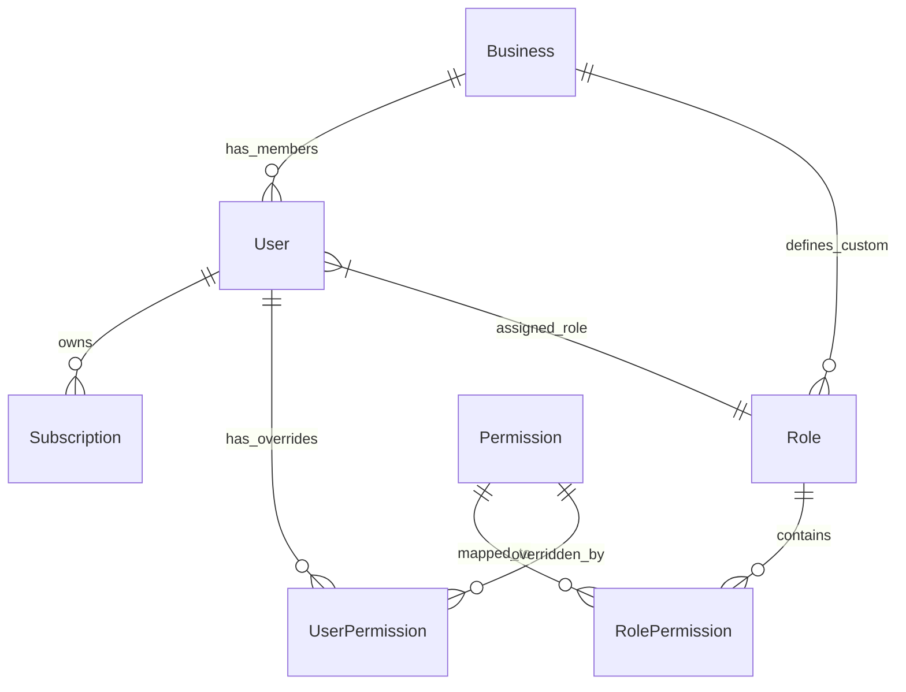
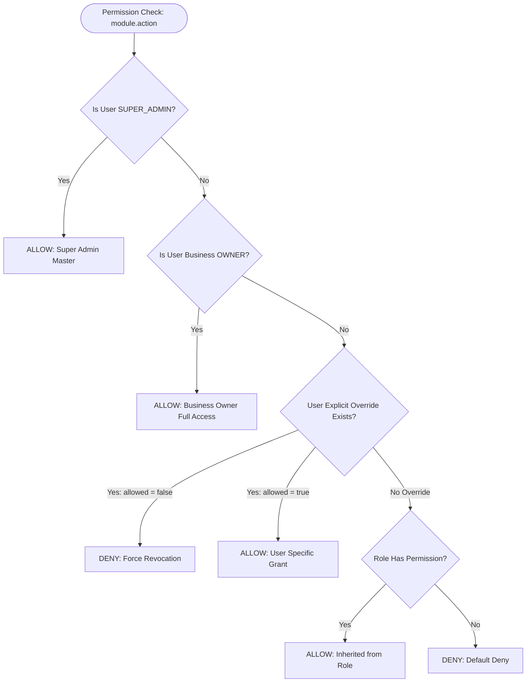
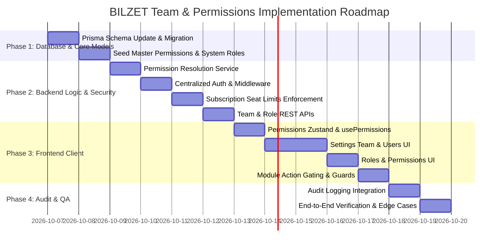

# 🛡️ BILZET — Team Management, Sub-Users & Granular Permissions System
## Architectural & Implementation Master Plan

> **Role:** Senior Full-Stack Architect & Security Engineer  
> **System:** BILZET SaaS POS & Multi-Warehouse ERP  
> **Target Engine:** React 18 (Vite, Zustand, Tailwind v4) + Node.js / Express (Prisma, PostgreSQL / NeonDB) + Clerk / JWT Auth  
> **Document Version:** `1.0.0`

---

## 1. Executive Summary & Existing System Analysis

### 1.1. Current Architecture State
The existing BILZET codebase operates with:
- **Authentication:** Dual-stack supporting Clerk SSO (`@clerk/express`, `@clerk/clerk-react`) and native JWT (`auth.middleware.mjs`, bcryptjs).
- **Existing User Model:** A single `User` entity with an enum role (`SUPER_ADMIN`, `ADMIN`, `MANAGER`, `CASHIER`, `SALES_STAFF`, `PURCHASE_STAFF`, `INVENTORY_STAFF`, `HR_MANAGER`, `VIEWER`).
- **Authorization:** Coarse role-checking middleware (`authorizeRoles(ROLES.ADMIN)`).
- **Subscription Engine:** `Subscription` model with plans `Free Starter`, `Pro`, and `Premium/Enterprise` storing plan tiers, expiration, and JSON features.
- **Frontend State:** Zustand stores (`auth.js`, `securityStore.js`), with route guards (`Protected`, `AdminEmailGuard`).

### 1.2. The Architectural Problem
1. **Flat User Hierarchy:** Every registered account is effectively an independent user; business owners cannot add sub-users (cashiers, inventory managers, accountants) tied to their specific business store.
2. **Coarse Role Enforcement:** Roles are coarse enums. An admin cannot grant a cashier permission to apply discounts or view sales reports without making them an admin.
3. **Missing Seat Quota Controls:** Subscriptions do not track or enforce `maxSubUsers` seat limits.
4. **Tenant Isolation Risk:** Sub-users must never see or manipulate data belonging to another tenant or owner.

### 1.3. Architecture Goals
- Introduce a **Tenant-Bound Sub-User Structure** where all sub-users inherit and operate strictly within the owner's `businessId` / `tenantId`.
- Introduce a **Granular Permission Model** (`Role`, `Permission`, `RolePermission`, `UserPermission`) supporting clean inheritance and user-specific overrides.
- Implement **Server-Side Seat Limits** based on active subscription tiers.
- Protect the **Business Owner** from self-demotion, deletion, or privilege escalation by sub-users.
- Maintain **100% Backward Compatibility** with existing owners, cashier demo accounts, and Super Admin.

---

## 2. Database Design & Prisma Schema Migration

### 2.1. Prisma Schema Evolution
We extend `BILZET_backend/prisma/schema.prisma` without dropping existing tables or deleting legacy roles.



### 2.2. Prisma Model Definitions

```prisma
// ─── 1. TENANT / BUSINESS ENTITY ───────────────────────────────────
model Business {
  id              String         @id @default(uuid())
  ownerId         String         @unique @map("owner_id")
  name            String         @default("My Business")
  gstin           String?
  phone           String?
  email           String?
  createdAt       DateTime       @default(now()) @map("created_at")
  updatedAt       DateTime       @updatedAt @map("updated_at")

  owner           User           @relation("BusinessOwner", fields: [ownerId], references: [id], onDelete: Cascade)
  members         User[]         @relation("BusinessMembers")
  roles           Role[]
  
  @@map("businesses")
}

// ─── 2. USER ENHANCEMENTS ──────────────────────────────────────────
// Existing User model extended with tenant & permission linkage
model User {
  id           String    @id @default(uuid())
  businessId   String?   @map("business_id")
  business     Business? @relation("BusinessMembers", fields: [businessId], references: [id])
  ownedBusiness Business? @relation("BusinessOwner")
  
  name         String
  email        String    @unique
  passwordHash String?   @map("password_hash")
  googleId     String?   @unique @map("google_id")
  avatar       String?
  
  // Legacy role preserved for backward compatibility
  role         RoleEnum  @default(CASHIER) @map("role")
  
  // Granular role association
  customRoleId String?   @map("custom_role_id")
  customRole   Role?     @relation(fields: [customRoleId], references: [id])
  
  isOwner      Boolean   @default(false) @map("is_owner")
  phone        String?
  isActive     Boolean   @default(true) @map("is_active")
  
  // Explicit permission overrides for this specific user
  permissionOverrides UserPermission[]

  createdAt    DateTime  @default(now()) @map("created_at")
  updatedAt    DateTime  @updatedAt @map("updated_at")

  sales        Sale[]
  expenses     Expense[]
  auditLogs    AuditLog[]
  subscriptions Subscription[]

  @@index([businessId])
  @@map("users")
}

// Rename enum to prevent collision with Role model
enum RoleEnum {
  SUPER_ADMIN
  ADMIN
  MANAGER
  CASHIER
  VIEWER
  SALES_STAFF
  PURCHASE_STAFF
  INVENTORY_STAFF
  HR_MANAGER
}

// ─── 3. GRANULAR ROLE MODEL ────────────────────────────────────────
model Role {
  id          String           @id @default(uuid())
  businessId  String?          @map("business_id")
  business    Business?        @relation(fields: [businessId], references: [id], onDelete: Cascade)
  name        String
  code        String           // e.g., 'CASHIER', 'SENIOR_CASHIER'
  description String?
  isSystem    Boolean          @default(false) @map("is_system")
  createdAt   DateTime         @default(now()) @map("created_at")
  updatedAt   DateTime         @updatedAt @map("updated_at")

  users       User[]
  permissions RolePermission[]

  @@unique([businessId, code])
  @@index([businessId])
  @@map("roles")
}

// ─── 4. PERMISSION MASTER ──────────────────────────────────────────
model Permission {
  id          String           @id @default(uuid())
  key         String           @unique // e.g. "billing.create", "reports.view"
  module      String           // e.g. "billing", "inventory", "reports"
  action      String           // e.g. "create", "view", "cancel"
  description String?
  createdAt   DateTime         @default(now()) @map("created_at")

  rolePermissions RolePermission[]
  userOverrides   UserPermission[]

  @@index([module])
  @@map("permissions")
}

// ─── 5. ROLE-PERMISSION JUNCTION ───────────────────────────────────
model RolePermission {
  id           String     @id @default(uuid())
  roleId       String     @map("role_id")
  role         Role       @relation(fields: [roleId], references: [id], onDelete: Cascade)
  permissionId String     @map("permission_id")
  permission   Permission @relation(fields: [permissionId], references: [id], onDelete: Cascade)

  @@unique([roleId, permissionId])
  @@map("role_permissions")
}

// ─── 6. USER-SPECIFIC PERMISSION OVERRIDE ──────────────────────────
model UserPermission {
  id           String     @id @default(uuid())
  userId       String     @map("user_id")
  user         User       @relation(fields: [userId], references: [id], onDelete: Cascade)
  permissionId String     @map("permission_id")
  permission   Permission @relation(fields: [permissionId], references: [id], onDelete: Cascade)
  allowed      Boolean    // true = force grant, false = force revoke

  @@unique([userId, permissionId])
  @@map("user_permissions")
}

// ─── 7. SUBSCRIPTION SEAT EXTENSION ────────────────────────────────
// Extended model fields for Subscription
// maxSubUsers: Int @default(0) @map("max_sub_users")
```

---

## 3. Granular Permission Catalog & Master Taxonomy

Each permission is identified by a standardized dot-notation key: `<module>.<action>`.

```
Catalog:
├── billing
│   ├── billing.view        (Access billing counter & invoices)
│   ├── billing.create      (Generate new sales bills)
│   ├── billing.edit        (Modify unfinalized draft bills)
│   ├── billing.cancel      (Cancel/void finalized invoices)
│   ├── billing.discount    (Apply manual discounts > 10%)
│   ├── billing.print       (Print A4/A5/thermal slips)
│   └── billing.export      (Export billing register)
├── inventory
│   ├── inventory.view      (View product catalog & stock levels)
│   ├── inventory.create    (Add new products & barcodes)
│   ├── inventory.edit      (Modify prices, descriptions, units)
│   ├── inventory.delete    (Deactivate or remove products)
│   ├── inventory.adjust    (Direct stock count increment/decrement)
│   └── inventory.transfer  (Execute inter-godown transfers)
├── sales_ops
│   ├── sales_ops.challan   (Generate & manage delivery challans)
│   ├── sales_ops.return    (Process sales returns & credit notes)
│   └── sales_ops.payment   (Record customer credit collections)
├── purchases
│   ├── purchases.view      (View supplier invoices & POs)
│   ├── purchases.create    (Create purchase bills & orders)
│   ├── purchases.edit      (Modify purchase orders)
│   └── purchases.debit     (Issue supplier debit notes)
├── customers
│   ├── customers.view      (Search customer directory & ledger)
│   ├── customers.create    (Add new customer accounts)
│   └── customers.edit      (Modify credit limit & GSTIN)
├── staff
│   ├── staff.view          (View staff roster)
│   ├── staff.attendance    (Mark daily employee punches)
│   └── staff.payroll       (Generate & disburse salary slips)
├── reports
│   ├── reports.view        (Access reports dashboard)
│   ├── reports.sales       (View sales revenue analytics)
│   ├── reports.profit_loss (View business P&L & COGS)
│   └── reports.export      (Export financial spreadsheets)
├── gst
│   ├── gst.view            (View GSTR-1 & GSTR-3B summaries)
│   └── gst.export          (Export CA upload JSON/Excel)
├── settings
│   ├── settings.view       (View store details & print settings)
│   ├── settings.edit       (Modify store profile & terms)
│   ├── team.view           (View sub-users & staff assignments)
│   ├── team.manage         (Invite, edit, deactivate sub-users)
│   ├── roles.manage        (Create & customize business roles)
│   └── subscription.manage (Upgrade, renew, or cancel plan)
└── audit_logs
    └── audit_logs.view     (Inspect security audit logs)
```

---

## 4. Default System Role Mappings

When the system seeds or creates standard business accounts, the following system roles are mapped automatically:

| Permission Group | OWNER / ADMIN | MANAGER | CASHIER | SALES STAFF | INVENTORY STAFF | HR MANAGER | VIEWER |
|---|:---:|:---:|:---:|:---:|:---:|:---:|:---:|
| `billing.view` | ✅ | ✅ | ✅ | ✅ | ❌ | ❌ | ✅ |
| `billing.create` | ✅ | ✅ | ✅ | ✅ | ❌ | ❌ | ❌ |
| `billing.cancel` | ✅ | ✅ | ❌ | ❌ | ❌ | ❌ | ❌ |
| `billing.discount` | ✅ | ✅ | ❌ | ❌ | ❌ | ❌ | ❌ |
| `billing.print` | ✅ | ✅ | ✅ | ✅ | ❌ | ❌ | ✅ |
| `inventory.view` | ✅ | ✅ | ✅ | ✅ | ✅ | ❌ | ✅ |
| `inventory.create` | ✅ | ✅ | ❌ | ❌ | ✅ | ❌ | ❌ |
| `inventory.adjust` | ✅ | ✅ | ❌ | ❌ | ✅ | ❌ | ❌ |
| `inventory.transfer`| ✅ | ✅ | ❌ | ❌ | ✅ | ❌ | ❌ |
| `purchases.*` | ✅ | ✅ | ❌ | ❌ | ✅ | ❌ | ❌ |
| `staff.attendance`| ✅ | ✅ | ❌ | ❌ | ❌ | ✅ | ❌ |
| `staff.payroll` | ✅ | ❌ | ❌ | ❌ | ❌ | ✅ | ❌ |
| `reports.profit_loss`| ✅ | ❌ | ❌ | ❌ | ❌ | ❌ | ❌ |
| `reports.sales` | ✅ | ✅ | ❌ | ❌ | ❌ | ❌ | ✅ |
| `gst.*` | ✅ | ✅ | ❌ | ❌ | ❌ | ❌ | ❌ |
| `settings.edit` | ✅ | ❌ | ❌ | ❌ | ❌ | ❌ | ❌ |
| `team.manage` | ✅ | ❌ | ❌ | ❌ | ❌ | ❌ | ❌ |
| `subscription.manage`| ✅ | ❌ | ❌ | ❌ | ❌ | ❌ | ❌ |

---

## 5. Effective Permission Precedence Engine

Permissions must be calculated deterministically on every secured operation using a 3-tier cascade:



### Precedence Algorithm:
1. **Super Admin Bypass**: Platform `SUPER_ADMIN` has unrestricted global access.
2. **Owner Bypass**: Store `isOwner = true` holds unrestricted access to all tenant modules.
3. **User Explicit Override**:
   - If `UserPermission` exists with `allowed: false` ➔ **DENY** (revocation takes precedence over role).
   - If `UserPermission` exists with `allowed: true` ➔ **ALLOW** (grant override).
4. **Role Permissions**: If assigned Role contains the permission ➔ **ALLOW**.
5. **Default Fallback**: **DENY**.

---

## 6. Multi-Tenant Isolation & Backend Security Architecture

### 6.1. Tenant Derivation Rule
- The frontend **never** supplies `businessId` in body payloads or query parameters.
- The backend derives `businessId` exclusively from `req.user.businessId`.
- Every Prisma query across all modules (`Sale`, `Product`, `Customer`, `Warehouse`, `Staff`, `AuditLog`) enforces:
  ```javascript
  where: {
    ...filter,
    businessId: req.user.businessId,
  }
  ```

### 6.2. Backward Compatibility for Legacy Accounts
To ensure existing users and test seeds do not break:
- If a user has `businessId === null` and `role === 'ADMIN'`, an auto-provisioning routine lazily generates a `Business` record for them on first login, setting them as `isOwner: true`.
- If a user has `role === 'SUPER_ADMIN'`, their `businessId` remains null and platform endpoints are accessed through `superAdminMiddleware`.

### 6.3. Centralized Permission Middleware (`permission.middleware.mjs`)

```javascript
import { ApiError } from '../utils/ApiError.mjs';
import { getEffectivePermissions } from '../services/permission.service.mjs';

/**
 * Enforces granular permission checks on route handlers
 * @param {string} permissionKey - e.g. "billing.create", "inventory.adjust"
 */
export const requirePermission = (permissionKey) => {
  return async (req, res, next) => {
    try {
      const user = req.user;
      if (!user) {
        return next(ApiError.unauthorized('Authentication required'));
      }

      if (!user.isActive) {
        return next(ApiError.forbidden('User account is deactivated'));
      }

      // Platform Super Admin bypasses tenant permission gates
      if (user.role === 'SUPER_ADMIN') {
        return next();
      }

      // Business Owner bypasses tenant-level permission gates
      if (user.isOwner) {
        return next();
      }

      // Resolve effective permissions
      const effectivePermissions = await getEffectivePermissions(user.id);
      
      if (!effectivePermissions.has(permissionKey)) {
        return next(
          ApiError.forbidden(
            `Access denied. You lack the required permission: '${permissionKey}'`
          )
        );
      }

      req.effectivePermissions = effectivePermissions;
      next();
    } catch (err) {
      next(err);
    }
  };
};
```

---

## 7. Subscription Seat Limits & Backend Enforcement

### 7.1. Configurable Plan Limits (No Hardcoding)
In `BILZET_backend/src/config/plans.config.mjs`:
```javascript
export const PLAN_SEAT_LIMITS = {
  FREE: 0,       // 0 sub-users (Only the business owner)
  PRO: 5,        // Up to 5 team sub-users
  ENTERPRISE: 15,// Up to 15 team sub-users
};
```
*Note: Super Admins can update a business's custom `maxSubUsers` via the subscription management endpoint in `/api/v1/super-admin/subscriptions`.*

### 7.2. Atomic Sub-User Creation Verification
In `user.service.mjs` / `user.controller.mjs`:
```javascript
export const canCreateSubUser = async (businessId) => {
  const business = await prisma.business.findUnique({
    where: { id: businessId },
    include: {
      owner: {
        include: {
          subscriptions: {
            where: { status: 'ACTIVE' },
            orderBy: { createdAt: 'desc' },
            take: 1,
          },
        },
      },
    },
  });

  const activeSub = business?.owner?.subscriptions?.[0];
  const planTier = activeSub?.planTier || 'FREE';
  const maxAllowed = activeSub?.maxSubUsers ?? (PLAN_SEAT_LIMITS[planTier] || 0);

  // Count current sub-users excluding the owner
  const currentCount = await prisma.user.count({
    where: {
      businessId,
      isOwner: false,
    },
  });

  return {
    allowed: currentCount < maxAllowed,
    currentCount,
    maxAllowed,
    planTier,
  };
};
```

If `allowed === false`, the backend returns HTTP 403:
```json
{
  "success": false,
  "code": "SUB_USER_LIMIT_REACHED",
  "message": "You have reached your plan's sub-user limit (5/5). Upgrade your plan to add more team members."
}
```

---

## 8. Anti-Privilege Escalation & Owner Protection Rules

To prevent malicious sub-users or compromised cashier accounts from hijacking a store:

1. **Owner Immutable Status**:
   - `isOwner` cannot be modified via API.
   - The user who created the business account cannot be deleted or deactivated by any sub-user.
2. **Self-Role Modification Blocked**:
   - An API request where `req.params.id === req.user.id` and `req.body.role` or `req.body.customRoleId` is present will be rejected with HTTP 403.
3. **Restricted Team Management**:
   - Only users with `team.manage` permission (or `isOwner: true`) can access `/api/v1/users` creation, update, or deactivation endpoints.
4. **Subscription Protection**:
   - Only the business owner can initiate plan changes or modify payment details. Sub-users receive `403 Forbidden`.

---

## 9. Comprehensive API Endpoint Design

All endpoints reside under `/api/v1`:

### 9.1. Team Members & Sub-Users (`/api/v1/users`)
- `GET /api/v1/users`: List all team members within the caller's `businessId`.
- `POST /api/v1/users`: Create a new sub-user (enforces seat limits & default role assignments).
- `GET /api/v1/users/:id`: Get full details of a specific team member.
- `PATCH /api/v1/users/:id`: Update name, phone, role assignment.
- `PATCH /api/v1/users/:id/status`: Toggle active/deactivated state (`isActive`).
- `DELETE /api/v1/users/:id`: Soft delete or remove sub-user (owner protected).
- `GET /api/v1/users/:id/permissions`: Get effective permissions with breakdown (Inherited vs Override).
- `PATCH /api/v1/users/:id/permissions`: Set or clear custom permission overrides.

### 9.2. Roles & Permissions Management (`/api/v1/roles`)
- `GET /api/v1/roles`: List available system roles and business custom roles.
- `POST /api/v1/roles`: Create a new custom role with selected permissions.
- `GET /api/v1/roles/:id`: Inspect role details and permission checklist.
- `PATCH /api/v1/roles/:id`: Modify role name or mapped permissions.
- `DELETE /api/v1/roles/:id`: Delete a custom role (system roles are protected from deletion).
- `GET /api/v1/permissions`: Master catalog of all available system permissions grouped by module.

### 9.3. Subscription Seat Usage (`/api/v1/subscription/usage`)
- `GET /api/v1/subscription/usage`: Returns:
  ```json
  {
    "planTier": "PRO",
    "usedSeats": 3,
    "maxSeats": 5,
    "remainingSeats": 2,
    "canAddUser": true
  }
  ```

---

## 10. Frontend Architecture, UI/UX & State Control

### 10.1. Centralized Permissions Hook & Utility
In `BILZET_frontend/src/hooks/usePermissions.js`:
```javascript
import { useAuth } from '../store/auth';

export function usePermissions() {
  const { user } = useAuth();

  const hasPermission = (permissionKey) => {
    if (!user) return false;
    if (user.role === 'SUPER_ADMIN') return true;
    if (user.isOwner) return true;
    if (user.role === 'GUEST') return false; // Guest demo controls

    // Check effective permissions loaded in user session
    return Boolean(user.effectivePermissions?.[permissionKey]);
  };

  const hasAnyPermission = (...keys) => keys.some((k) => hasPermission(k));
  const hasAllPermissions = (...keys) => keys.every((k) => hasPermission(k));

  return { hasPermission, hasAnyPermission, hasAllPermissions, isOwner: user?.isOwner };
}
```

### 10.2. Route & Component Guards
- `<RequirePermission permission="reports.view">`: Automatically redirects unauthorized users to `/dashboard` with an alert toast.
- Action-level gating:
  ```jsx
  {hasPermission("billing.cancel") && (
    <button onClick={handleCancelInvoice} className="text-rose-600">
      Cancel Invoice
    </button>
  )}
  ```

### 10.3. New UI Views

#### 1. Settings → Team & Users Tab (`/settings?tab=team`)
- **Seat Quota Banner**: Glassmorphic counter card: `"3 of 5 Team Seats Used"`.
- **Team Table**: Member name, email, phone, role badge, status indicator, last login date.
- **Action Triggers**: `Add Team Member`, `Customize Permissions`, `Deactivate`, `Delete`.

#### 2. "Add Team Member" Modal
- **Form Fields**: Full Name, Email, Temporary Password / Send Invitation, Phone, Role dropdown.
- **Permission Preview**: As soon as a role is chosen, an accordion displays the permissions inherited from that role.
- **"Customize Permissions" Toggle**: Lets the admin toggle individual actions on/off immediately.

#### 3. Settings → Roles & Permissions Tab (`/settings?tab=roles`)
- **System Roles List**: (Cashier, Manager, Inventory Staff, etc.) marked with a locked badge.
- **Custom Roles List**: (e.g., "Senior Cashier", "Floor Supervisor") with edit and delete options.
- **Role Creator Dialog**: Grouped permission checkboxes with "Select All in Module" toggles.

#### 4. User Permission Inspection Drawer
- Color-coded legend:
  - 🟢 **Inherited from Role** (Green badge)
  - 🔵 **User-Specific Override: Granted** (Blue badge)
  - 🔴 **User-Specific Override: Revoked** (Red badge)
  - ⚪ **Default Deny** (Grey badge)

---

## 11. Security Audit Logging

All team and permission actions are recorded in the PostgreSQL `audit_logs` table via `audit.service.mjs`:

| Event Key | Action Logged | Captured Metadata |
|---|---|---|
| `USER_CREATED` | New team sub-user created | `actorUserId`, `targetUserId`, `roleId`, `initialPermissions` |
| `USER_DEACTIVATED` | Member account suspended | `actorUserId`, `targetUserId`, `reason` |
| `USER_REACTIVATED` | Member account restored | `actorUserId`, `targetUserId` |
| `USER_ROLE_CHANGED` | Role reassigned | `actorUserId`, `targetUserId`, `previousRole`, `newRole` |
| `PERMISSION_OVERRIDE` | Explicit permission changed | `actorUserId`, `targetUserId`, `permissionKey`, `allowed` |
| `ROLE_CREATED` | New custom business role | `actorUserId`, `roleCode`, `permissionsList` |
| `ROLE_UPDATED` | Role permissions altered | `actorUserId`, `roleId`, `diffPayload` |

---

## 12. Offline & Demo Mode Compatibility

In `BILZET_frontend/src/api/mockData.js`:
- Provide realistic mock team members (e.g., `Rajesh Kumar - Senior Cashier`, `Priya Sharma - Inventory Lead`).
- Provide mock role sets and permission definitions.
- The `withFallback` interceptor ensures that if a user opens the **Team & Users** or **Roles & Permissions** tab in demo mode, the UI renders mock data seamlessly without throwing unhandled exceptions.

---

## 13. Phased Implementation Roadmap



### Phase 1: Database & Core Models
1. Update `BILZET_backend/prisma/schema.prisma` with `Business`, `Role`, `Permission`, `RolePermission`, `UserPermission`, and `Subscription.maxSubUsers`.
2. Generate Prisma Client (`npx prisma generate`) and push schema (`npx prisma db push`).
3. Create `prisma/seedPermissions.mjs` to populate the master catalog of permissions and map default system roles.

### Phase 2: Backend Services & REST APIs
1. Create `permission.service.mjs` (calculates effective permissions with precedence).
2. Create `subscription.service.mjs` (calculates active seat usage and remaining capacity).
3. Create `requirePermission` middleware in `permission.middleware.mjs`.
4. Implement `/api/v1/users`, `/api/v1/roles`, `/api/v1/permissions`, and `/api/v1/subscription/usage`.
5. Integrate audit logging into `audit.service.mjs`.

### Phase 3: Frontend State & UI Components
1. Update `auth.js` store to maintain `effectivePermissions` and `isOwner`.
2. Create `usePermissions` hook and `<RequirePermission>` guard.
3. Build **Team & Users** view in `BILZET_frontend/src/pages/Settings.jsx` (or dedicated sub-component).
4. Build **Roles & Permissions** studio with permission checkboxes grouped by category.
5. Build **Add Team Member** dialog with subscription seat validation and upgrade prompts.
6. Gate action buttons in Billing, Purchases, Inventory, and Reports.

### Phase 4: Testing & Verification
1. Verify Cashier account cannot access Reports or Purchases APIs (assert 403 Forbidden).
2. Verify tenant isolation: Sub-user from Tenant A cannot see products or sales from Tenant B.
3. Verify plan limit: Cannot add 6th user on Pro plan (assert `SUB_USER_LIMIT_REACHED`).
4. Verify owner account cannot be deleted or demoted.

---

## 14. Verification Test Cases Checklist

| ID | Test Scenario | Expected Outcome |
|---|---|---|
| **TC-01** | Cashier attempts to call `GET /api/v1/reports/sales` | HTTP 403 Forbidden with `{ message: "Access denied" }` |
| **TC-02** | Cashier attempts to call `POST /api/v1/sales/:id/cancel` | HTTP 403 Forbidden |
| **TC-03** | Cashier granted explicit override for `billing.cancel` | Action succeeds and invoice is cancelled |
| **TC-04** | Sub-user attempts to modify their own role via `PATCH /api/v1/users/:id` | HTTP 403 Forbidden (Anti-Privilege Escalation) |
| **TC-05** | Admin on Pro Plan (max 5) creates 6th sub-user | HTTP 403 Forbidden with `SUB_USER_LIMIT_REACHED` |
| **TC-06** | Sub-user queries `GET /api/v1/products` | Only products matching `businessId` are returned |
| **TC-07** | Sub-user attempts to delete business owner via `DELETE /api/v1/users/:ownerId`| HTTP 403 Forbidden (Owner Protection) |
| **TC-08** | Deactivated user attempts to access any protected endpoint | HTTP 403 Forbidden with account deactivated message |
| **TC-09** | Super Admin queries `/api/v1/super-admin/overview` | Platform data accessible without tenant restriction |
| **TC-10** | Team member permission override changed | Record logged in `audit_logs` with before/after diff |

---

*Architectural Plan formulated for BILZET Engineering Team. Ready for phased implementation.*
